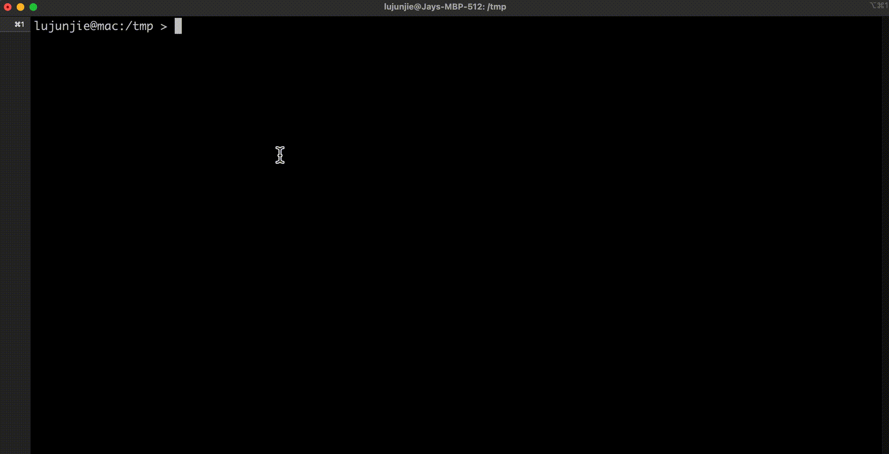

# History Fuzzy Search (hfs)

`history-fuzzy-search` (hfs) is a command line tool that enhances your terminal experience by enabling quick and efficient fuzzy searching through your command history. It supports both Bash and Zsh shells.

This is my experimental project for learning rust with github copilot, it's simple but working pretty well. If you want to find something more powerful and flexible, maybe take a look at [fzf](https://github.com/junegunn/fzf) instead.

## Features

- Reads command history from Bash and Zsh history files.
- Provides fuzzy search to filter through command history.
- User-friendly interface with keyboard navigation.
- Copies selected commands to the clipboard for easy pasting.

## Usage

After installing `hfs`, invoke it from the terminal and start typing to search your command history.



- Input multiple keyword to do fuzzy search from command line history.
- Use the Up/Down arrow keys to navigate through the search results.
- Press `Enter` or `Esc` to copy the selected command to the clipboard.

## Installation

Install `hfs` to `~/.cargo/bin` and ensure `~/.cargo/bin` is included in your `$PATH` to run `hfs` directly from the terminal.

### Install via Cargo

```bash
cargo install history-fuzzy-search
```

### Install via Git

```bash
git clone https://github.com/jaylu/history-fuzzy-search.git
cd history-fuzzy-search
cargo build --release
cargo install --path .
```

## Development

To build and run `hfs` locally:

```shell
# Build the project
cargo build

# Run the project
cargo run

# Install the `hfs` binary in ~/.cargo/bin for local testing
cargo install --path .
```

## Contributing

Contributions are welcome! Open an issue or submit a pull request for enhancements or bug fixes.

## License

This project is licensed under the MIT License. See the LICENSE file for more details.
